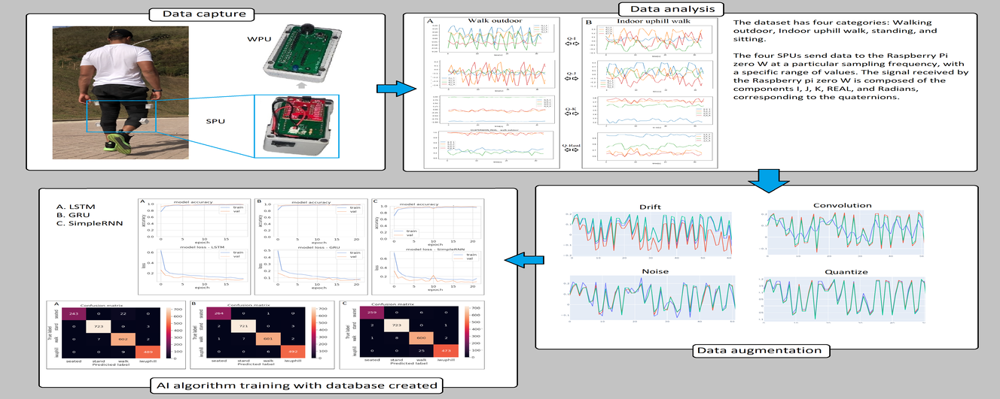
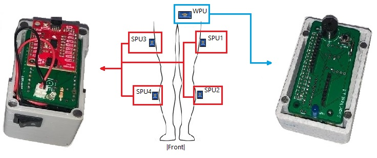

# Resources and extra documentation for the manuscript

"AI-based personalized Human Activity Recognition in walking and trekking sports: A case study" published in IEEE Latin America Transactions.

# Code using in paper for creating IA models to HAR

Extra resources and documentation for the manuscript "AI-based personalized Human Activity Recognition in walking and trekking sports: A case study" published in IEEE Latin America Transactions. The code uses the Python programming language to perform the data agumentation of the data and also the construction of AI algorithms for classifying the data collected by the user.

## About Sensors

This repository uses data collected by wearable sensors to train AI models to recognize human activities. The sensors are positioned as shown in the image below:

Each sensor has the following responsibilities:

WPU: Sensor responsible for collecting data from the four spu sensors.

SPUs: Sensors inform the spatial location of the user.

## About Dataset

The dataset was developed to perform the classification of two human activities, walking outdoors and indoors.

[Dataset without data agumentation](https://www.kaggle.com/datasets/jonathansilva2020/recognition-of-human-activity-har-four-classes)

[Dataset with data agumentation](https://www.kaggle.com/datasets/jonathansilva2020/recognition-of-human-activity-data-agumentation)

The dataset has the following categories:

    * seated: Data collected in a fixed sitting position in an ordinary chair.

    * stand: Data collected in a fixed position with legs extended, standing.

    * walking: Data collected on the street with an average speed of 3km/h.

    * wuphill: Data collected indoors, a walking activity equipment with incline and speed of 5 km/h.
    
## About AI Models

Three deep learning algorithms were used for data classification.

* LSTM
* GRU
* Simple RNN

[Code](LSTM_GRU_RNN_data_aug.ipynb)

